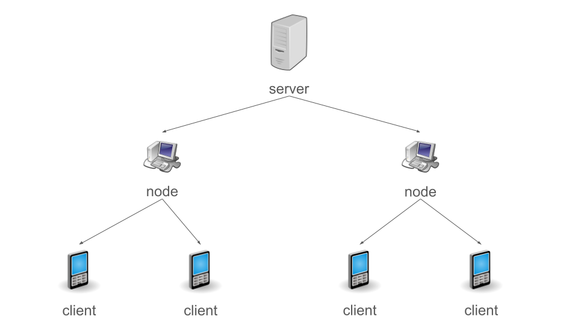

# GSM From Scratch
No, not actually GSM though.

## Goals
The main goal of this project is to create an easily deployable GSM-like system using a globally accessible server, some devices with internet access and radio modules as well as clients with the same radio modules.

This is a dumb project being made by a student, but it can have some real uses -- in businesses with multiple locations around the world, for example.

## Architecture

### Server
The main server that handles all messages (and, in the future, calls). Only on the server you can create new subscribers. The server has a private key for encrypting messages and provides a public key to nodes and to clients through nodes for message verification. Must have internet connectivity.

### Node
The bridge between the server and clients. There can be multiple of them for each server. Clients can connect to nodes using arbitrary protocols and technologies (AT later on), e. g. NRF24 modules. Must have internet access and AT.

### Client
Connects to nodes using AT. Can connect to any node and any node must accept the client if it can be verified. Must have AT, doesn't have to have internet connectivity.